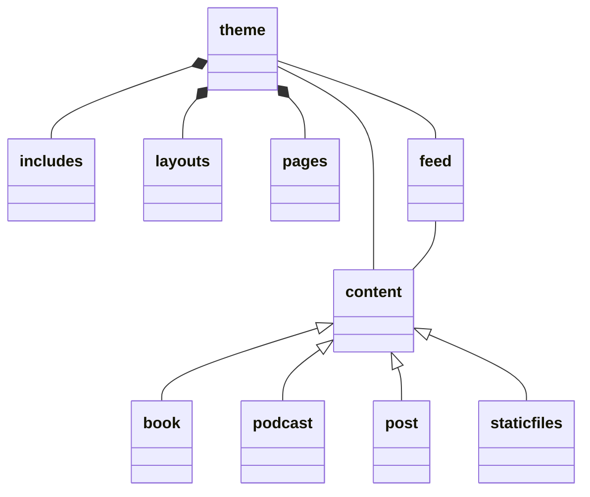

# robintegg

[](https://app.netlify.com/sites/awesome-golick-a6b04a/deploys)

https://www.robintegg.com

# Design



# Finding Podcast Links

https://podnews.net/search?q=

# Building website

```
com.robintegg.web.Build.main();
```

# Running JWebServer

```
cd target\site
C:\Users\teggro01\.jdks\temurin-19.0.2\bin\jwebserver   
```
