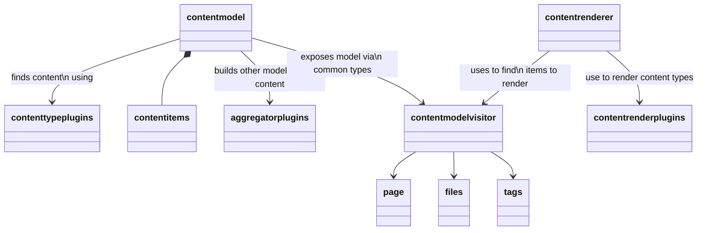

# Mermaid Diagramming

Having recently purchased [Creating Software with Modern Diagramming Techniques](https://robintegg.com/books/creating-software-with-modern-diagramming-techniques.html) I've been working through the chapters and examples to get into the habit of using the mermaid syntax and diagrams so  that I can have a web ready alternative to [PlantUml](https://plantuml.com/) and also it's the only tool we've got installed on our confluence instance.

I've also added a Mermaid plugin to my website to enable the rendering of Mermaid in my markdown files. This was a combination of extended my theme so that the Mermaid js files are added and also adjusting the rendering of the [markdown](https://github.com/commonmark/commonmark-java) code blocks for mermaid so they render as `<pre class="mermaid">` which is the format required by the JS lib .

The below example is a `classDiagram` showing the web site building domain. 

